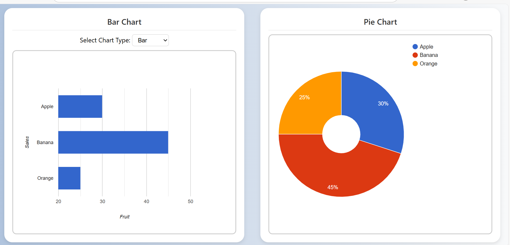

# 📊 SAS Viya + Google Charts Dashboard

A custom Data-Driven Content (DDC) visualization for SAS Viya using Google Charts, featuring a responsive bar and pie chart combo with interactive filtering, chart type switching, and custom tooltips.

 

---

## 🚀 Features

- 📈 Toggle between **Bar**, **Column**, and **Line** charts
- 🥧 Enlarged **Pie Chart** with interactive filtering
- 🧠 **Custom tooltips** with formatted values
- 🎨 Smooth **animations** via `animations.css`
- 🌈 **Modern UI** with soft gradients and card layout
- ✅ Compatible with **SAS Visual Analytics DDC**

---

## 🛠️ How to Use

1. **Clone this repo** or download the files:
   ```bash
   git clone https://github.com/ANKI050/New-folder
